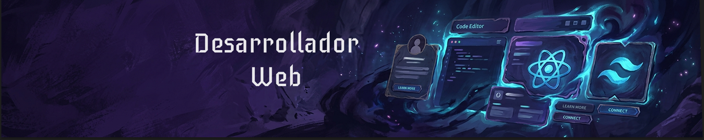

# ¡Hola! Soy Anthony Brito 👋

 

Me apasiona la tecnología, estoy en pleno camino hacia el desarrollo Fullstack. Me gusta aprender haciendo, por lo que uso mis proyectos para demostrar y reforzar los conocimientos que he ido adquiriendo.

### 🔭 ¿Qué estoy haciendo actualmente?
* 🎓 Estudiante de Desarrollo Fullstack en **ConquerBlocks**.
* ⚛️ Perfeccionando el uso de hooks y lógica avanzada en **React**.
* 🇬🇧 Practicando inglés diariamente para colaborar en entornos globales.

### 🛠️ Stack Tecnológico

---
*En constante aprendizaje y evolución tecnológica.*
<!--
**AnthonyBrito-dev/AnthonyBrito-dev** is a ✨ _special_ ✨ repository because its `README.md` (this file) appears on your GitHub profile.

Here are some ideas to get you started:

- 🔭 I’m currently working on ...
- 🌱 I’m currently learning ...
- 👯 I’m looking to collaborate on ...
- 🤔 I’m looking for help with ...
- 💬 Ask me about ...
- 📫 How to reach me: ...
- 😄 Pronouns: ...
- ⚡ Fun fact: ...
-->
